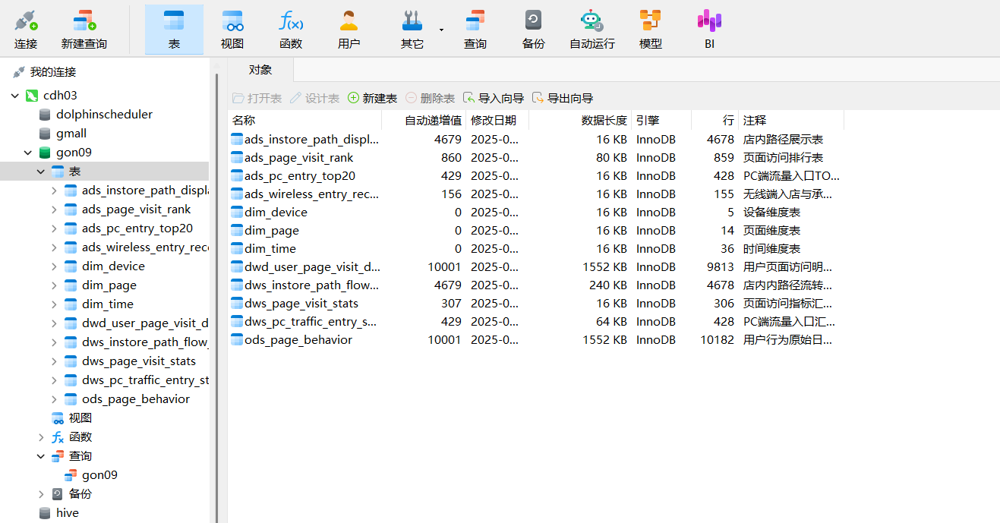

# 2020-08-01 日报   姜天宇

1. Python 机器学习 - 挖掘标签模型开发及算法模型构建 09 - 流量主题店内路径看板》 设计文档（终版）重新加载一下
[设计文档.md](../gongdan/09%E6%96%B0/%E8%AE%BE%E8%AE%A1%E6%96%87%E6%A1%A3.md)

2.数据重新写 用python 直接生成表格  把数据写到mysql中
用 pymysql 写
[1.python_mysql](../gongdan/09%E6%96%B0/09/1.python_mysql)

3.把mysql生成数据成 在用脚本生成存储hdfs里 (出现错误正在解决)
[2.把mysql表和数据导入csv格式](../gongdan/09%E6%96%B0/09/2.%E6%8A%8Amysql%E8%A1%A8%E5%92%8C%E6%95%B0%E6%8D%AE%E5%AF%BC%E5%85%A5csv%E6%A0%BC%E5%BC%8F)

### 2025-08-02 目标:
Python 机器学习 - 挖掘标签模型开发及算法模型构建 09 - 流量主题店内路径看板》 
数据出来，写到测试