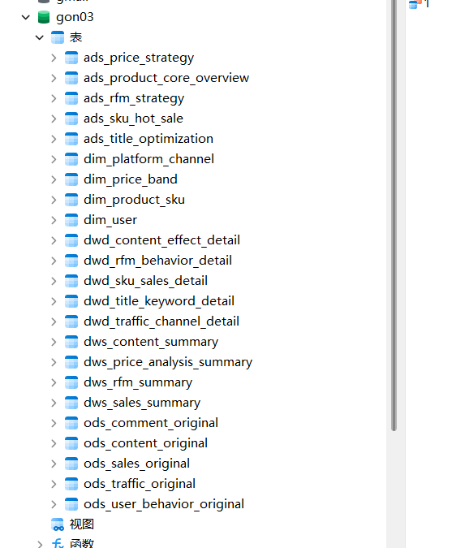

# 2025-08-07 日报   姜天宇

1.《Python机器学习-客户价值模型RFM构建03-商品主题商品360看板》 (报表完成)

[03新](../gongdan/03%E6%96%B0)
 
2.《Python机器学习-客户价值模型RFM构建08-商品主题营销工具客服专属优惠》（指标生成完成，ods进行中）
[08](../gongdan/08)

### 2025-08-08 目标:

《Python 机器学习 - 客户价值模型 RFM 构建 08 - 商品主题营销工具客服专属优惠》
完成

