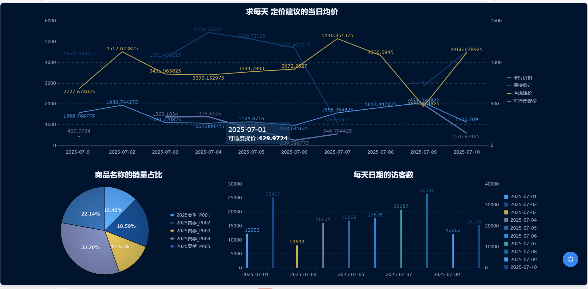
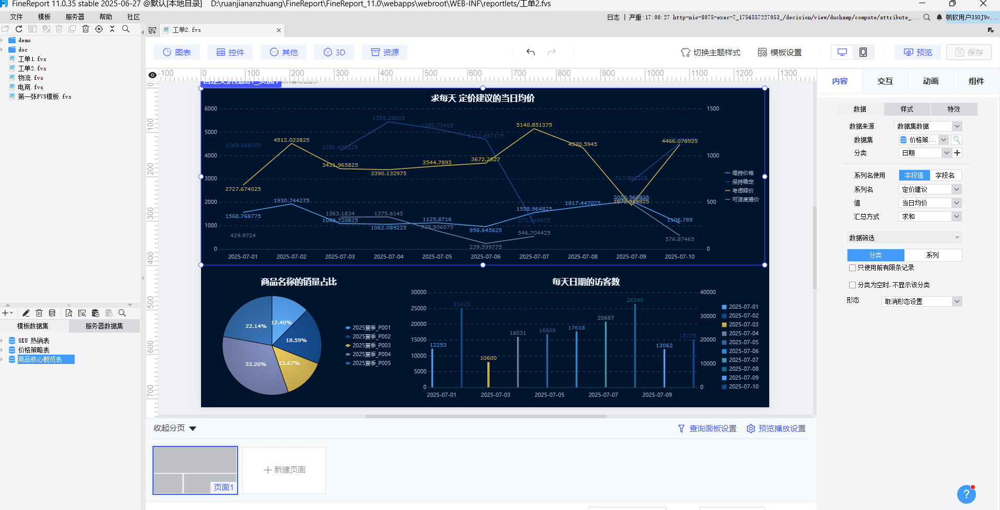

### 一、ODS 原始表层（5 张表）

#### 1. `ods_sales_original` **销售原始记录表**

|表名|指标|说明|
|---|---|---|
|ods_sales_original|订单时间|记录订单生成的具体时间，可用于分析销售的时间分布规律，如不同时段、不同日期的销售高峰|
|ods_sales_original|商品 ID|商品的唯一标识，便于区分不同商品的销售情况|
|ods_sales_original|SKU ID|库存进出计量的基本单元标识，可精确到商品的具体规格，分析不同规格商品的销售表现|
|ods_sales_original|SKU 属性（颜色 / 尺寸）|商品的具体属性，有助于了解消费者对不同属性商品的偏好|
|ods_sales_original|销售数量|该订单中商品的销售个数，是计算销售额、分析销售规模的重要指标|
|ods_sales_original|单价|单个商品的价格，结合销售数量可得出订单金额|
|ods_sales_original|订单金额|本次订单的总金额，反映了每笔交易的规模|
|ods_sales_original|购买用户 ID|购买商品的用户标识，用于关联用户信息，分析不同用户群体的消费行为|
|ods_sales_original|支付时间|用户完成支付的时间，可分析支付时长、支付时间分布等，优化支付流程|
|ods_sales_original|退款状态|记录订单是否退款及相关情况，可评估商品质量、客户满意度等|

#### 2. `ods_traffic_original` **流量原始记录表**

|表名|指标|说明|
|---|---|---|
|ods_traffic_original|平台（platform）|用户访问平台的类型，如 iOS、Android、Web 等，可分析不同平台的流量来源和用户特征|
|ods_traffic_original|渠道（channel）|用户进入平台的渠道，如 App Store、搜索引擎等，用于评估不同推广渠道的效果|
|ods_traffic_original|访客 ID|访问平台的访客的唯一标识，可统计访客数量、分析访客的行为轨迹|
|ods_traffic_original|访问时间|访客访问平台的时间，可分析流量的时间分布规律|
|ods_traffic_original|点击行为（是否点击商品）|记录访客是否点击了平台上的商品，反映了商品的吸引力和用户的兴趣度|
|ods_traffic_original|转化行为（是否加购 / 下单）|记录访客是否有加购商品或者下单的行为，用于衡量流量的转化率|
|ods_traffic_original|入口页面|访客进入平台时的起始页面，可优化页面布局和导航，提高用户留存率|

#### 3. `ods_user_behavior_original` **用户行为原始记录表**

|表名|指标|说明|
|---|---|---|
|ods_user_behavior_original|用户 ID|用户的唯一标识，用于跟踪单个用户的行为|
|ods_user_behavior_original|搜索词|用户在平台上输入的搜索关键词，可了解用户的需求和兴趣，优化搜索功能|
|ods_user_behavior_original|访问路径（页面序列）|用户在平台上的访问页面顺序，分析用户的浏览习惯和行为路径|
|ods_user_behavior_original|停留时长|用户在各个页面上停留的时间，反映页面的吸引力和内容质量|
|ods_user_behavior_original|浏览商品 ID|用户浏览过的商品 ID，分析用户的兴趣商品范围|
|ods_user_behavior_original|加入购物车时间|用户将商品加入购物车的时间，可研究用户的购买决策过程|
|ods_user_behavior_original|支付记录（商品 ID / 金额 / 时间）|用户支付的相关信息，包括购买的商品 ID、支付金额和支付时间，用于分析用户的消费金额和时间偏好|
|ods_user_behavior_original|标题词根点击记录|用户点击商品标题词根的相关记录，有助于优化商品标题关键词|

#### 4. `ods_content_original` **内容原始记录表**

|表名|指标|说明|
|---|---|---|
|ods_content_original|内容 ID|平台上内容的唯一标识，可对不同内容进行区分和跟踪|
|ods_content_original|内容类型（直播 / 短视频 / 图文）|内容的表现形式，不同类型内容可能有不同的传播效果和受众|
|ods_content_original|发布时间|内容发布到平台的时间，可分析内容发布的时间规律和时效性|
|ods_content_original|关联商品 ID|该内容所关联的商品 ID，用于评估内容对商品销售的促进作用|
|ods_content_original|曝光量|该内容被展示的次数，反映内容的传播广度|
|ods_content_original|点击量|该内容被点击的次数，体现内容的吸引力和用户的关注度|
|ods_content_original|观看时长|用户观看该内容的总时长，可衡量内容的质量和用户的沉浸度|
|ods_content_original|转化量（通过内容下单数）|通过该内容引导下单的数量，是评估内容营销效果的关键指标|

#### 5. `ods_comment_original`**评价原始记录表**

|表名|指标|说明|
|---|---|---|
|ods_comment_original|评价 ID|评价的唯一标识，方便对评价进行管理和查询|
|ods_comment_original|商品 ID|被评价商品的 ID，可分析不同商品的评价情况|
|ods_comment_original|SKU ID|被评价商品 SKU 的 ID，更精准地定位评价对应的商品规格|
|ods_comment_original|评价用户 ID（是否老买家）|进行评价的用户的 ID，同时标注是否为老买家，可对比新老买家的评价差异|
|ods_comment_original|评分（1 - 5 星）|用户对商品的评分，直观反映用户对商品的满意度|
|ods_comment_original|评价内容|用户撰写的评价文字，包含用户对商品的具体意见和感受|
|ods_comment_original|评价时间|用户提交评价的时间，可分析评价的时间分布和时效性|
|ods_comment_original|是否主动评价|记录用户是否是主动进行评价，有助于了解用户参与评价的积极性|

### 二、DIM 维度表层（4 张表）

#### 1. `dim_platform_channel`**平台渠道维度表**

|表名|指标|说明|
|---|---|---|
|dim_platform_channel|平台 ID|平台的唯一标识，用于区分不同的平台|
|dim_platform_channel|平台名称（iOS/Android/Web）|具体的平台名称，便于直观了解平台类型|
|dim_platform_channel|渠道 ID|渠道的唯一标识，用于管理和区分不同的推广渠道|
|dim_platform_channel|渠道名称（App Store / 搜索引擎等）|具体的渠道名称，明确流量来源的渠道|
|dim_platform_channel|渠道类型（官方 / 第三方）|渠道的类型，可评估不同类型渠道的质量和效果|

#### 2. `dim_product_sku` **商品 SKU 维度表**

|表名|指标|说明|
|---|---|---|
|dim_product_sku|商品 ID|商品的唯一标识，用于关联其他与商品相关的数据|
|dim_product_sku|商品名称|商品的具体名称，方便识别商品|
|dim_product_sku|SKU ID|库存进出计量的基本单元标识，精确区分商品规格|
|dim_product_sku|SKU 属性（颜色 / 尺寸 / 材质）|商品的具体属性，可用于分析用户对不同属性商品的偏好|
|dim_product_sku|所属类目|商品所属的大的类别，便于对商品进行分类管理和分析|
|dim_product_sku|子类目|商品所属的更细的子类，进一步细化商品分类|
|dim_product_sku|上架时间|商品上架到平台的时间，可分析商品的销售周期和时效性|
**商品 SKU 维度表**
#### 3. `dim_user`**用户维度表**

|表名|指标|说明|
|---|---|---|
|dim_user|用户 ID|用户的唯一标识，用于关联用户的各种行为和信息|
|dim_user|注册时间|用户在平台注册的时间，可分析用户的注册趋势和活跃度|
|dim_user|用户标签（新客 / 老客）|对用户的分类标签，便于区分不同类型的用户|
|dim_user|会员等级|用户的会员等级，可分析不同会员等级用户的消费行为和价值|

#### 4. `dim_price_band`**价格带维度表**

|表名|指标|说明|
|---|---|---|
|dim_price_band|价格带 ID|价格带的唯一标识，用于区分不同的价格区间|
|dim_price_band|价格区间（0 - 50 元 / 50 - 100 元等）|具体的价格范围，可用于分析不同价格区间商品的销售情况|
|dim_price_band|所属类目|该价格带对应的商品类目，可对比不同类目在各价格带的表现|

### 三、DWD 明细数据层（5 张表）

#### 1. `dwd_sku_sales_detail` **SKU 销售明细表**

|表名|指标|说明|
|---|---|---|
|dwd_sku_sales_detail|商品 ID|商品的唯一标识，用于与其他商品相关数据关联|
|dwd_sku_sales_detail|SKU ID|库存进出计量的基本单元标识，精准定位商品规格|
|dwd_sku_sales_detail|SKU 属性|商品的具体属性，方便分析不同属性商品的销售情况|
|dwd_sku_sales_detail|日期|销售数据对应的日期，可分析销售的时间变化趋势|
|dwd_sku_sales_detail|销售数量|该日期该 SKU 的销售个数，是分析销售规模的重要指标|
|dwd_sku_sales_detail|销售金额|该日期该 SKU 的销售总金额，反映销售的收入情况|
|dwd_sku_sales_detail|热销指数（销量 / 类目平均销量）|衡量商品在所属类目内的热销程度，可找出热门商品|
|dwd_sku_sales_detail|库存余量|该 SKU 在该日期的库存数量，用于库存管理和补货决策|

#### 2. `dwd_traffic_channel_detail`**流量渠道明细表**

|表名|指标|说明|
|---|---|---|
|dwd_traffic_channel_detail|平台|用户访问平台的类型，与流量来源相关|
|dwd_traffic_channel_detail|渠道|用户进入平台的渠道，可评估不同渠道的流量贡献|
|dwd_traffic_channel_detail|日期|流量数据对应的日期，分析流量的时间分布|
|dwd_traffic_channel_detail|访客数（UV）|该日期通过该渠道访问平台的独立访客数量，反映渠道的流量规模|
|dwd_traffic_channel_detail|点击数|该日期该渠道产生的点击次数，体现用户的兴趣度|
|dwd_traffic_channel_detail|加购数|该日期通过该渠道用户加购商品的数量，可分析渠道的转化潜力|
|dwd_traffic_channel_detail|下单数|该日期通过该渠道用户下单的数量，是衡量渠道转化效果的关键指标|
|dwd_traffic_channel_detail|渠道转化率（下单数 / 访客数）|反映该渠道将访客转化为下单用户的能力|

#### 3. `dwd_title_keyword_detail`**标题关键词明细表**

| 表名                       | 指标                       | 说明                               |
| ------------------------ | ------------------------ | -------------------------------- |
| dwd_title_keyword_detail | 商品 ID                    | 商品的唯一标识，关联商品相关数据                 |
| dwd_title_keyword_detail | 标题词根                     | 商品标题中的关键词根，用于优化商品标题              |
| dwd_title_keyword_detail | 搜索次数                     | 该标题词根被搜索的次数，反映用户对相关关键词的需求程度      |
| dwd_title_keyword_detail | 引流人数（UV）                 | 通过该标题词根引流到商品页面的独立访客数量，评估词根的引流效果  |
| dwd_title_keyword_detail | 词根转化率（成交数 / 引流人数）        | 衡量该标题词根将引流访客转化为成交用户的能力           |
| dwd_title_keyword_detail | 品类词 / 长尾词 / 修饰词分类及对应引流数据 | 对标题词根进行分类，并分析不同类型词根的引流效果，优化关键词策略 |

#### 4. `dwd_content_effect_detail`（续）**内容效果明细表**

|表名|指标|说明|
|---|---|---|
|dwd_content_effect_detail|点击率（点击量 / 曝光量）|反映内容被展示后吸引用户点击的能力，衡量内容的吸引力和展示效果|
|dwd_content_effect_detail|转化率（成交数 / 点击量）|体现点击内容的用户最终转化为成交用户的比例，是评估内容营销效果的关键指标|
|dwd_content_effect_detail|TOP50 排名|该内容在相关排名中的位置，可直观对比不同内容的受欢迎程度和影响力|

#### 5. `dwd_rfm_behavior_detail`**RFM 行为明细表**

|表名|指标|说明|
|---|---|---|
|dwd_rfm_behavior_detail|用户 ID|用户的唯一标识，用于关联用户的 RFM 行为分析|
|dwd_rfm_behavior_detail|商品 ID|与用户行为相关的商品唯一标识，可分析用户对不同商品的消费行为|
|dwd_rfm_behavior_detail|最近消费时间（recency）|记录用户最近一次消费的时间，是衡量用户活跃度和忠诚度的重要指标|
|dwd_rfm_behavior_detail|消费次数（frequency）|用户在一定时间内的消费次数，反映用户的消费频率和对平台的依赖程度|
|dwd_rfm_behavior_detail|累计消费金额（monetary）|用户在一定时间内的总消费金额，体现用户的消费能力和价值|
|dwd_rfm_behavior_detail|访问时间|用户访问平台的时间，可用于分析用户的访问规律和兴趣偏好|
|dwd_rfm_behavior_detail|支付时间|用户完成支付的时间，进一步精确分析用户的消费行为时间节点|

### 四、DWS 汇总数据层（4 张表）

#### 1. `dws_sales_summary`**销售汇总表**

| 表名                | 指标                    | 说明                            |
| ----------------- | --------------------- | ----------------------------- |
| dws_sales_summary | 商品 ID                 | 商品的唯一标识，用于汇总特定商品的销售数据         |
| dws_sales_summary | 日期                    | 销售汇总数据对应的日期，便于分析销售的时间趋势       |
| dws_sales_summary | 总营收                   | 在该日期该商品的总销售收入，是衡量销售业绩的关键指标    |
| dws_sales_summary | 总销量                   | 在该日期该商品的总销售数量，反映商品的市场需求程度     |
| dws_sales_summary | 热销 SKU 排名             | 对商品下不同 SKU 的热销程度进行排名，帮助识别畅销产品 |
| dws_sales_summary | 新客订单占比                | 新客户产生的订单在总订单中的比例，可评估市场拓展效果    |
| dws_sales_summary | 老客订单占比                | 老客户产生的订单在总订单中的比例，体现客户忠诚度和留存情况 |
| dws_sales_summary | 运营节点（新客折扣 / 分期免息）关联销量 | 记录特定运营活动期间的销量，评估运营策略的效果       |

#### 2. `dws_price_analysis_summary`**价格分析汇总表**

|表名|指标|说明|
|---|---|---|
|dws_price_analysis_summary|商品 ID|商品的唯一标识，用于对特定商品进行价格分析|
|dws_price_analysis_summary|日期|价格分析数据对应的日期，可观察价格随时间的变化|
|dws_price_analysis_summary|价格|该日期商品的销售价格，是价格分析的基础数据|
|dws_price_analysis_summary|价格趋势（当日 vs 前日变动）|对比当日与前日价格的变化情况，分析价格波动趋势|
|dws_price_analysis_summary|所属价格带|商品所在的价格区间，便于与同价格带商品进行比较|
|dws_price_analysis_summary|价格力星级|对商品价格竞争力的评级，帮助评估价格在市场中的优势|
|dws_price_analysis_summary|同类目同价格带商品均价|同品类且在相同价格带内商品的平均价格，为商品定价提供参考|
|dws_price_analysis_summary|同星级商品转化率基准|相同价格力星级商品的转化率标准，用于评估商品的转化效果|

#### 3. `dws_rfm_summary`**RFM 汇总表**

|表名|指标|说明|
|---|---|---|
|dws_rfm_summary|用户 ID|用户的唯一标识，用于对用户进行 RFM 综合分析|
|dws_rfm_summary|商品 ID|与用户 RFM 行为相关的商品唯一标识，可分析用户对不同商品的价值倾向|
|dws_rfm_summary|recency（天数）|用户最近一次消费距离统计日期的天数，量化用户的活跃程度|
|dws_rfm_summary|frequency（次数）|用户在统计周期内的消费次数，反映用户的消费频繁程度|
|dws_rfm_summary|monetary（金额）|用户在统计周期内的总消费金额，体现用户的消费能力|
|dws_rfm_summary|r_score（1 - 5 分）|根据 recency 指标为用户打分，分数越高表示用户越活跃|
|dws_rfm_summary|f_score（1 - 5 分）|根据 frequency 指标为用户打分，分数越高表示用户消费越频繁|
|dws_rfm_summary|m_score（1 - 5 分）|根据 monetary 指标为用户打分，分数越高表示用户消费能力越强|
|dws_rfm_summary|rfm_total（总分）|r_score、f_score 和 m_score 的总和，综合评估用户的价值和重要性|

#### 4. `dws_content_summary`**内容汇总表**

|表名|指标|说明|
|---|---|---|
|dws_content_summary|内容类型|内容的表现形式，如直播、短视频等，用于区分不同类型内容的效果|
|dws_content_summary|日期|内容汇总数据对应的日期，可分析内容效果随时间的变化|
|dws_content_summary|TOP50 内容总点击量|排名前 50 的该类型内容的总点击次数，反映热门内容的吸引力|
|dws_content_summary|总转化率|该类型内容的总体转化率，衡量该类型内容的营销效果|
|dws_content_summary|不同类型内容效果对比（直播 vs 短视频）|对比不同类型内容的关键指标（如点击量、转化率等），为内容策略制定提供依据|

### 五、ADS 应用数据层（5 张表）

#### 1. `ads_product_core_overview`**商品核心概览表**

|表名|指标|说明|
|---|---|---|
|ads_product_core_overview|商品 ID|商品的唯一标识，聚焦特定商品的核心数据|
|ads_product_core_overview|日期|数据对应的日期，便于跟踪商品数据的时间变化|
|ads_product_core_overview|核心数据趋势（营收 / 销量 / 访客数）|展示商品在营收、销量和访客数等关键指标上的趋势变化，帮助把握商品的运营态势|
|ads_product_core_overview|点击趋势|商品页面的点击量随时间的变化趋势，反映商品的吸引力和曝光效果|
|ads_product_core_overview|运营节点（新客折扣 / 短视频发布）关联指标（销量增幅 / 访客增幅）|记录特定运营活动对商品销量和访客数的影响，评估运营活动的效果|
#### 2. `ads_sku_hot_sale`**SKU 热销表**

| 表名               | 指标              | 说明                                      |
| ---------------- | --------------- | --------------------------------------- |
| ads_sku_hot_sale | 商品 ID           | 商品的唯一标识，用于定位到具体商品。                      |
| ads_sku_hot_sale | SKU ID          | 库存进出计量的基本单元标识，能精确到商品的具体规格。              |
| ads_sku_hot_sale | SKU 属性          | 描述商品具体的规格属性，如颜色、尺寸、材质等，便于了解不同属性的销售情况。   |
| ads_sku_hot_sale | 热销程度排名          | 根据销售数据对 SKU 的热销程度进行排名，可直观判断哪些 SKU 更受欢迎。 |
| ads_sku_hot_sale | 销量占比            | 该 SKU 的销量在商品总销量中的占比，反映其对整体销售的贡献度。       |
| ads_sku_hot_sale | 库存预警            | 表明 SKU 的库存是否处于需要关注的状态，如是否接近缺货等，有助于及时补货。 |
| ads_sku_hot_sale | 推广建议（重点推广 / 补货） | 基于热销程度、库存等情况给出的推广或补货方面的建议，为运营决策提供参考。    |

#### 3. `ads_price_strategy`**价格策略表**

|表名|指标|说明|
|---|---|---|
|ads_price_strategy|商品 ID|商品的唯一标识，用于针对特定商品制定价格策略。|
|ads_price_strategy|价格带分布|显示商品在不同价格区间的分布情况，可分析商品的价格定位。|
|ads_price_strategy|本店价格水位（高于 / 低于均值）|对比本店商品价格与同类型商品平均价格的高低情况，了解价格竞争力。|
|ads_price_strategy|价格力星级|对商品价格竞争力的量化评价，星级越高表示价格优势可能越明显。|
|ads_price_strategy|同类目价格排行榜|展示同类目商品的价格排名，可明确商品在市场中的价格位置。|
|ads_price_strategy|定价建议（提价 / 降价）|根据价格带分布、价格水位、价格力星级等指标给出的定价调整建议，帮助优化价格策略。|

#### 4. `ads_title_optimization`**标题优化表**

|表名|指标|说明|
|---|---|---|
|ads_title_optimization|商品 ID|商品的唯一标识，确定需要优化标题的商品。|
|ads_title_optimization|当前标题词根|商品当前标题所包含的关键词根，是优化的基础。|
|ads_title_optimization|词根引流效果排名（UV / 转化率）|根据词根带来的独立访客数（UV）和转化率对词根进行排名，了解哪些词根更有效。|
|ads_title_optimization|优化建议词根|基于词根引流效果分析给出的用于优化标题的建议词根，以提升标题吸引力。|
|ads_title_optimization|修改后标题同步状态|表明商品标题修改后是否同步更新到相关平台或页面，确保优化的有效实施。|

#### 5. `ads_rfm_strategy`**RFM 策略表**

| 表名               | 指标                        | 说明                                      |
| ---------------- | ------------------------- | --------------------------------------- |
| ads_rfm_strategy | 用户分层（高价值 / 潜力 / 流失）       | 根据用户的 RFM 分析结果对用户进行分层，便于针对不同层次用户制定策略。   |
| ads_rfm_strategy | 对应 RFM 得分                 | 显示每个用户分层所对应的 RFM 得分，量化用户价值和行为特征。        |
| ads_rfm_strategy | 商品策略（高端 SKU / 性价比品 / 清库存） | 根据用户分层为不同类型用户匹配的商品策略，如向高价值用户推荐高端 SKU 等。 |
| ads_rfm_strategy | 直通车投放人群建议                 | 基于用户分层和商品策略，给出适合直通车投放的目标人群建议，提高广告投放效果。  |

综上所述，这 23 张表从原始数据的采集（ODS 层），经过维度定义（DIM 层）、明细数据处理（DWD 层）、汇总计算（DWS 层），最终到应用层面的数据输出（ADS 层），构建了一个完整的数据体系。通过对各表指标的分析，可以全面了解电商业务的各个环节，包括销售情况、流量来源、用户行为、内容效果、价格策略等，从而为电商运营提供有力的数据支持，辅助制定精准的营销策略、优化用户体验和提升业务绩效。

#### `ads_price_strategy`**价格策略表**
1. 求每天 定价建议的当日均价

####   `ads_sku_hot_sale`**SKU 热销表
2. 商品名称的销量占比

#### `ads_product_core_overview`**商品核心概览表**
3.  每天日期的访客数