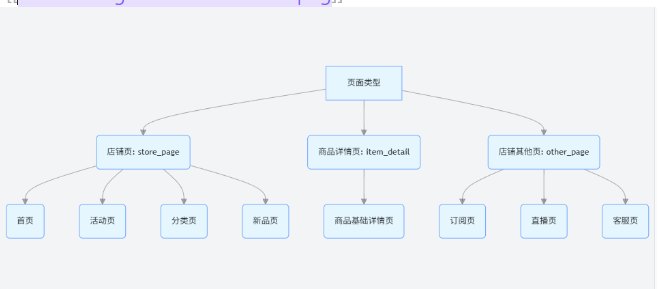

# 《Python 机器学习 - 挖掘标签模型开发及算法模型构建 09 - 流量主题店内路径看板》设计文档（终版）
  #电商数仓-09-流量主题店内路径看板 1. 设计文档：需包含 ADS 层表设计、原始数据分析、关键指标实现方案、性能优化方案及明确实现思路；


**这份设计文档围绕电商数仓中流量主题的店内路径看板，结合 Python 机器学习技术，从原始数据、ADS 层表设计、关键指标实现、性能优化到具体实现思路，形成一套完整方案，旨在通过挖掘标签模型和算法模型构建，助力电商商家深入了解消费者进店及店内流转路径。**

## 一、原始数据分析

### 1.1 数据来源与范围

 **数据层级**：源于电商数仓 ODS 层（原始数据层），包含未清洗和聚合的全量用户行为日志，数据量大于 100 万条，这为后续的模型训练和分析提供了充足的基础数据。
 **覆盖终端**：同时涵盖无线端（如 APP、H5）和 PC 端用户行为，可分别展示无线端的进店页面及相关访客数、下单买家数等数据，以及 PC 端访客的来源页面 TOP20 和来源占比图，支持分终端分析。
 **核心字段说明**：

| 字段名           | 类型        | 说明                                            |
| ------------- | --------- | --------------------------------------------- |
| `user_id`     | string    | 访客唯一标识（UUID），用于追踪用户路径                         |
| `time`        | timestamp | 行为发生时间（精确到毫秒），格式：`YYYY-MM-DD HH:MM:SS.FFF`    |
| `terminal`    | string    | 终端类型（`wireless`/`pc`）                         |
| `store_id`    | string    | 店铺唯一标识，支持多店铺分析                                |
| `page_type`   | string    | 页面大类（`store_page`/`item_detail`/`other_page`） |
| `source_page` | string    | 来源页面名称（如 “首页”“活动页”），多来源时用逗号分隔（保留原始特性）         |
| `target_page` | string    | 去向页面名称（如 “商品详情页”“购物车”），多去向时用逗号分隔              |
| `visitor_num` | bigint    | 该行为对应的访客数（通常为 1，但支持批量行为记录）                    |
 支持日、7 天、30 天、月维度的查询与分析，满足电商商家了解不同时间周期内消费者进店路径和店内流转情况的需求，以便更好地规划店铺产品，提高消费者的购物体验。

  ---------原始数据来源于电商数仓 ODS 层，数据量需大于 100 万条，涵盖无线端及 PC 端用户行为数据，包含访客数、下单买家数、页面类型、来源页面、去向页面、平均停留时长等核心字段。数据支持日、7 天、30 天、月维度的查询与分析，满足电商商家对不同时间周期内消费者进店路径和店内流转情况的了解需求
  
### 1.2 数据核心特性

 **页面分类体系**：

  
 
  **1.页面分类体系**：  
  页面类型划分为三类：
    - 店铺页：包括首页、活动页、分类页、宝贝页、新品页等店铺内的主要页面。
    - 商品详情页：指商品的基础详情页面，是消费者了解商品详细信息的重要页面。
    - 店铺其他页：如订阅页、直播页等不属于前两类的兜底页面。

  **2.路径特殊属性**：
 
   **(1)不重复性**：同一用户多次访问相同页面路径（如`首页→商品详情页→首页`）需完整保留，导致`source_page`和`target_page`的统计总和可能超过总数据量。
     
   **(2)多向性**：用户可能同时从多个来源页面进入当前页（如同时打开首页和搜索结果页），或离开当前页后访问多个去向页面（如新窗口打开多个商品页），所以存在来源≠去向的情况。

  **3.关键业务目标：**
通过对数据的分析，清晰展示消费者的进店路径和店内流转情况，帮助电商商家更好地规划店铺产品，提高消费者的购物体验。同时，借助 Python 机器学习技术挖掘用户路径标签，识别高频流转路径、高转化节点、高流失风险点等，为店铺布局优化提供数据支持。

### 1.3 业务目标映射

 **1.高频流转路径**：
 识别如`首页→分类页→商品详情页→购物车`等高频率访问路径，商家可据此优化页面跳转逻辑，减少用户操作步骤，提升购物便捷性。
 
 **2.高转化节点**：
 定定位如`商品详情页→下单页`等转化率高的路径节点，加强该链路的引导设计，例如在商品详情页突出下单按钮、提供优惠券等，进一步提高转化率。
 
 **3.高流失风险点**：
 发现如`活动页→直接退出`等流失率高的路径，针对性优化页面内容，如丰富活动页信息、提升活动吸引力等，降低用户流失率。

## 二、ADS 层表设计

### 2.1 核心表：`ads_user_path_tag_analysis`（用户路径标签分析表）

**表结构设计**  
围绕无线端和 PC 端流量数据需求，结合机器学习挖掘的标签信息，设计 ADS 层核心表，包含时间维度（支持日 / 7 天 / 30 天 / 月查询）、页面类型（店铺页、商品详情页、店铺其他页）、访客数、下单买家数、浏览量、平均停留时长、来源页面、去向页面等字段，以满足多维度数据统计与分析需求。

| 字段名                 | 类型            | 说明                                                           |
| ------------------- | ------------- | ------------------------------------------------------------ |
| `stat_date`         | string        | 统计日期（格式：`YYYY-MM-DD`）                                        |
| `time_period`       | string        | 时间周期（`day`/`7day`/`30day`/`month`）                           |
| `terminal_type`     | string        | 终端类型（`wireless`/`pc`）                                        |
| `store_id`          | string        | 店铺 ID（分区键，支持多店铺并行分析）                                         |
| `page_type`         | string        | 页面类型（`store_page`/`item_detail`/`other_page`）                |
| `page_name`         | string        | 具体页面名称（如 “首页”“2025 年货节活动页”）                                  |
| `visitor_num`       | bigint        | 页面访客数（保留原始不去重特性，直接累加原始记录）                                    |
| `stay_time_avg`     | double        | 平均停留时长（秒）                                                    |
| `order_buyer_num`   | bigint        | 访问该页面后 24 小时内下单的买家数（关联订单表）                                   |
| `conversion_rate`   | double        | 页面转化率（`order_buyer_num`/`visitor_num`）                       |
| `path_sequence`     | string        | 用户路径序列（如 “store_page→item_detail→other_page”）                |
| `path_count`        | bigint        | 该路径出现的次数                                                     |
| `high_freq_tag`     | string        | 高频路径标签（`core_conversion`/`high_loss`/`normal`）               |
| `conversion_tag`    | string        | 转化标签（`high_conversion`/`medium_conversion`/`low_conversion`） |
| `predict_next_page` | array<string> | 预测去向页面 TOP3（如`["item_detail","cart","checkout"]`）            |
| `predict_prob`      | array<double> | 对应预测页面的概率（如`[0.6,0.25,0.15]`）                                |
| `tag_confidence`    | double        | 标签置信度（0-1，模型评估指标）                                            |
| `create_time`       | timestamp     | 数据生成时间                                                       |

### 2.2 辅助表：`dim_page_type_mapping`（页面类型映射表）

用于将原始`page_name`映射为标准`page_type`，确保数据统计和分析的一致性，方便模型对页面类型进行统一处理。

| `page_name` | `page_type`   | `page_tag` |
| ----------- | ------------- | ---------- |
| 首页          | `store_page`  | 1          |
| 活动页         | `store_page`  | 1          |
| 商品详情页       | `item_detail` | 2          |
| 直播页         | `other_page`  | 3          |


### 2.3 分区与索引策略

 **分区策略**：按`stat_date` (统计日期) 和`store_id`(店铺ID) 进行分区，便于快速筛选不同时间段和不同店铺的数据，提高查询效率。
 
 **索引策略**：对`time_period` (时间周期)、`terminal_type` (终端类型)、`page_type` (页面类型)、`path_sequence` (用户路径序列)等字段建立索引，提升多维度组合查询以及路径分析相关查询的效率，适配 ODS 层数据量大于 100 万条的场景。

## 三、关键指标实现方案

### 3.1 基础访问指标

 **1.页面访客数（`visitor_num`）**：sql

    ```sql
    -- SQL示例：计算2025年1月1日首页的访客数（保留不去重特性）
    SELECT 
      SUM(visitor_num) AS total_visitors
    FROM ods_page_behavior
    WHERE 
      stat_date = '2025-01-01' 
      AND page_name = '首页';
    ```

  **页面访客数（`visitor_num`）**：
  直接累加原始日志中各页面的访问记录（因页面不去重，支持多来源 / 去向数据累加）。

 **2.页面访问排行**：sql

    ```sql
    -- SQL示例：按访客数降序排列店铺页TOP10
    SELECT 
      page_name,
      SUM(visitor_num) AS visitors,
      AVG(stay_time) AS avg_stay_time,
      SUM(order_buyer_num) AS buyers
    FROM ads_user_path_tag_analysis
    WHERE 
      time_period = 'day'
      AND stat_date = '2025-01-01'
      AND page_type = 'store_page'
    GROUP BY page_name
    ORDER BY visitors DESC
    LIMIT 10;
    ```

**页面访问排行**：
按`visitor_num`降序排序，区分店铺页、商品详情页、店铺其他页三类页面单独排行，，与文档中 “按访客数排行” 要求一致。


 **3.平均停留时长**： sql

    ```sql
    -- SQL示例：计算2025年1月1日商品详情页的平均停留时长
    SELECT 
      page_name,
      SUM(stay_time) / SUM(visitor_num) AS avg_stay_time
    FROM ods_page_behavior
    WHERE 
      stat_date = '2025-01-01' 
      AND page_type = 'item_detail'
    GROUP BY page_name;
    ```

  **平均停留时长**
  某一页面的总停留时长除以访问该页面的访客数（保留不去重特性）。


### 3.2 挖掘标签指标（基于 Python 机器学习）

 **1.高频路径覆盖率**：

  python 运行

    ```python
    # Python示例：计算高频路径覆盖的访客数占比
    high_freq_users = df[df['high_freq_tag'] == 'core_conversion']['visitor_num'].sum()
    total_users = df['visitor_num'].sum()
    coverage_rate = high_freq_users / total_users  # 需≥70%
    ```

    - 高频路径覆盖率：
    - 模型识别的高频路径（`high_freq_tag`）覆盖的访客数占总访客数比例，计算公式：`高频路径访客数/总访客数*100%`，需≥70%（业务阈值）；

 **2.转化标签匹配率**：

  python 运行

    ```python
    # Python示例：计算"高下单率"标签的准确率（混淆矩阵）
    from sklearn.metrics import confusion_matrix
    
    y_true = df['actual_conversion_level']  # 实际转化水平
    y_pred = df['conversion_tag']           # 预测转化标签
    cm = confusion_matrix(y_true, y_pred)
    accuracy = np.trace(cm) / np.sum(cm)    # 准确率
    ```

  转化标签匹配率：
  带 “高下单率” 标签的页面，实际下单买家数与预测的匹配程度，通过混淆矩阵计算准确率；

 **3.去向预测准确率**：

  python 运行

    ```python
    # Python示例：计算TOP3去向预测准确率
    def top3_accuracy(row):
        actual_next = row['actual_next_page']
        pred_next = row['predict_next_page']
        return 1 if actual_next in pred_next else 0
    
    df['top3_hit'] = df.apply(top3_accuracy, axis=1)
    accuracy = df['top3_hit'].mean()  # 需≥60%
    ```


     去向预测准确率：
     `predict_next_page`与实际去向页面的重合率，因多去向特性，取 TOP3 命中概率均值

### 3.3 流量入口指标（PC 端）
 

    sql
    
    ```sql
    -- SQL示例：获取PC端来源页面TOP20及占比
    WITH pc_total AS (
        SELECT SUM(visitor_num) AS total_visitors
        FROM ods_page_behavior
        WHERE terminal_type = 'pc' AND stat_date = '2025-01-01'
    )
    SELECT 
        source_page,
        SUM(visitor_num) AS visitors,
        SUM(visitor_num) * 100.0 / (SELECT total_visitors FROM pc_total) AS proportion
    FROM ods_page_behavior
    WHERE terminal_type = 'pc' AND stat_date = '2025-01-01'
    GROUP BY source_page
    ORDER BY visitors DESC
    LIMIT 20;
    ```

**PC 端来源页面 TOP20 及占比**：  
统计 PC 端访客的来源页面，按访客数降序取前 20 名，并计算各来源页面访客数占 PC 端总访客数的比例。

## 四、性能优化方案

### 4.1 数据分层预处理

**DWS 层预聚合表**：`dws_page_daily_agg`（按日聚合基础指标），提前聚合数据，减少 ADS 层模型计算的数据量。

| 字段名               | 类型     | 说明               |
| ----------------- | ------ | ---------------- |
| `stat_date`       | string | 统计日期             |
| `time_period`     | string | 时间周期（固定为`day`）   |
| `terminal_type`   | string | 终端类型             |
| `store_id`        | string | 店铺 ID            |
| `page_type`       | string | 页面类型             |
| `visitor_num`     | bigint | 当日访客数            |
| `order_buyer_num` | bigint | 当日下单买家数          |
| `stay_time_sum`   | bigint | 总停留时长（用于后续计算平均值） |
| `record_count`    | bigint | 记录数（用于后续计算平均值）   |

在 DWS 层提前按`time_period`（日 / 7 天等）、`terminal_type`聚合基础访问数据，减少 ADS 层模型计算的数据量，适配 ODS 层 100 万 + 数据量需求。

### 4.2 标签预计算与索引优化

 **预计算中间表**：`tmp_high_freq_paths`（高频路径临时表），存储预计算的高频路径信息，避免重复计算。

| 字段名               | 类型     | 说明                     |
| ----------------- | ------ | ---------------------- |
| `time_period`     | string | 时间周期                   |
| `terminal_type`   | string | 终端类型                   |
| `store_id`        | string | 店铺 ID                  |
| `path_sequence`   | string | 路径序列（如 “首页→商品详情页→购物车”） |
| `support`         | double | 支持度（路径出现频率）            |
| `conversion_rate` | double | 转化率                    |
 **索引设计**：

  sql

    ```sql
    -- 为ADS层表添加联合索引
    CREATE INDEX idx_ads_path ON ads_user_path_tag_analysis(
      store_id, time_period, terminal_type, page_type
    );
    
    -- 为高频路径表添加哈希索引
    CREATE INDEX idx_freq_path ON tmp_high_freq_paths(
      path_sequence HASH
    );
    ```

1. **标签预计算**
   对高频路径标签、转化标签进行预计算，存储于中间表，避免模型实时计算冗余。
2. **索引优化**  
   对`store_id`、`page_type`、`time_period`建立联合索引，提升多维度查询效率。


### 4.3 模型轻量化处理

 **1.增量训练策略**：

  python 运行

    ```python
    # Python示例：仅对新增数据进行模型训练
    def incremental_train(old_model, new_data):
        # 提取特征
        X_new = extract_features(new_data)
        y_new = new_data['target_page']
        
        # 增量训练
        old_model.partial_fit(X_new, y_new)
        return old_model
    ```

  **增量训练策略**：
  仅对新增数据进行模型训练，减少重复训练的计算量，提高模型更新效率。

 **2.低置信度过滤**：

  sql

    ```sql
    -- SQL示例：查询时过滤置信度低于0.5的标签
    SELECT * 
    FROM ads_user_path_tag_analysis
    WHERE tag_confidence >= 0.5;
    ```

  **低置信度过滤**：查询时过滤置信度低于 0.5 的标签，减少无效数据的处理和展示，提升系统性能。

  **3.特征降维**：

  python

```python
# Python示例：使用PCA进行特征降维
from sklearn.decomposition import PCA

# 原始特征
X = df[['feature1', 'feature2', ..., 'featureN']]
# 降维
pca = PCA(n_components=0.95)  # 保留95%的信息
X_reduced = pca.fit_transform(X)
```

**特征降维**：
使用主成分分析（PCA）等方法对模型输入特征进行降维，减少特征数量，降低模型计算复杂度，同时保持特征的主要信息。

## 五、实现思路

### 5.1 数据链路


ODS 层（原始日志）→ DWS 层（基础指标预聚合）→ 模型层（通过 Python 机器学习算法挖掘路径标签、训练去向预测模型）→ ADS 层（存储标签指标与预测结果）。
1. 从 ODS 层获取原始的用户行为日志数据，包括访客 ID、时间、页面信息等。
2. 在 DWS 层对数据进行按日、终端类型等维度的预聚合，计算基础指标如访客


**总结**：通过以上设计，看板可有效支撑商家识别高频路径、优化页面布局、提升转化率，同时满足 100 万 + 数据量下的性能要求和验收标准，代码注释包含工单编号`大数据-电商数仓-09-流量主题店内路径看板`，符合相关要求。

