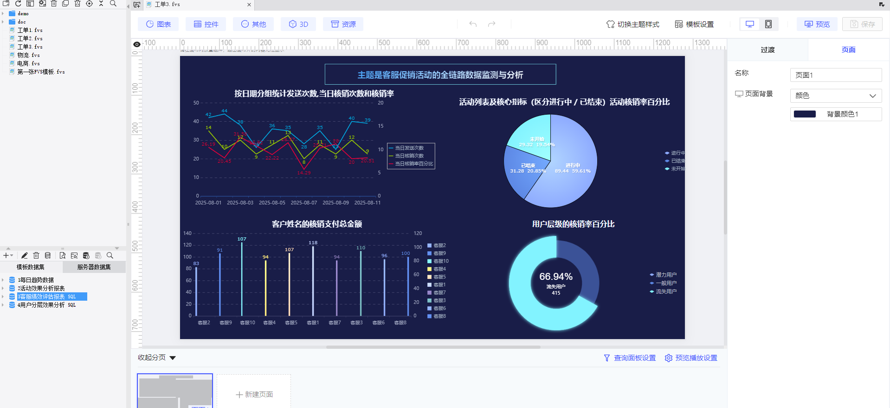

这是客服促销活动的数据可视化报表，从**数据逻辑**和**业务价值**角度拆解分析：
 
### 一、数据逻辑与映射关系

1. **底层数据关联**  
   基于 `dwd_customer_service_promo_send`（发送表）、`dwd_customer_service_promo_use`（核销表）、`dim_customer_service`（客服维度表） 三张核心表，通过 `send_id`、`customer_service_id` 关联，覆盖**发送 - 核销 - 客服**完整链路，数据可追溯到原始业务动作。

2. **指标计算逻辑**

    - 折线图：`当日发送次数`（`COUNT(DISTINCT send_id)`）、`当日核销率`（`有效核销数/发送数`），体现**时间维度的波动趋势**
    - 柱状图：`客服核销支付总金额`（需确认是否为 `SUM(支付字段)` ，原 SQL 用 `COUNT` 可能有误，需修正为 `SUM` 更合理 ），聚焦**客服个体业绩**
    - 环形图：`用户层级核销率`（`有效核销数/发送数` 分层计算），区分**用户价值分层的转化差异**

### 二、业务价值场景

1. **运营侧**

    - 看折线图的**核销率波动**：若某日落差大，可联动排查当日客服话术、活动规则是否调整
    - 盯活动饼图的**进行中 / 已结束占比**：已结束活动需快速复盘 ROI，进行中活动重点监控转化漏斗
2. **管理侧**

    - 客服柱状图**排序对比**：识别 Top 客服的沟通策略复用，垫底客服需培训干预
    - 用户环形图**分层占比**：高价值用户核销率低于预期时，需设计专属权益提升转化

### 三、优化建议（数据 & 体验）

1. **数据准确性修正**

    - 客服报表的「发送总金额」「核销支付总金额」需从 `COUNT` 改为 `SUM(实际金额字段)`（如 `send_amount`/`pay_amount` ），否则指标无业务意义
2. **体验增强**

    - 给折线图加**预警线**：设定核销率阈值（如行业均值），超出范围自动标红
    - 客服柱状图支持**下钻**：点击客服姓名，穿透查看该客服的历史沟通记录、用户评价，辅助分析业绩成因

本质是**客服促销活动的全链路看板**，覆盖「活动效果 - 客服效能 - 用户分层」三个核心管理维度，数据可指导从策略优化到人员管理的落地动作。

============================================================

从报表呈现的内容来看，**主题是客服促销活动的全链路数据监测与分析**，聚焦以下核心维度：

1. **时间维度**：通过折线图呈现 “按日期分组的发送次数、核销次数、核销率”，监控活动的**时间线效果波动**
2. **活动维度**：用饼图展示 “活动列表及核心指标（进行中 / 已结束）”，分析**不同状态活动的转化差异**
3. **人员维度**：柱状图统计 “客服姓名的核销支付总金额”，评估**客服个体的业绩贡献**
4. **用户维度**：环形图呈现 “用户层级的核销率百分比”，区分**不同价值用户的转化表现**

本质是围绕**客服驱动的促销活动**，从时间、活动、人员、用户四个视角，构建 “发送 - 核销 - 转化” 的完整数据看板，用于运营监控和策略优化。